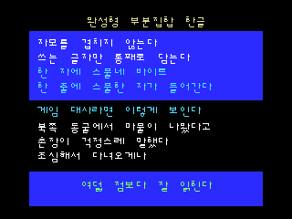
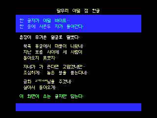
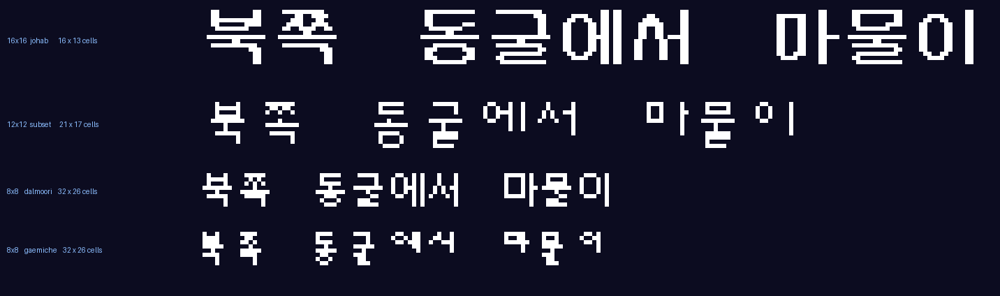

**한국어** · [English](#msx2-hangul-on-a-cartridge)

# MSX2 한글 출력 예제

MSX2 카트리지 롬 네 개입니다. 8비트 기계에서 한글을 찍는 방법을 나란히 놓았습니다.
갈리는 지점은 **자모를 언제 겹치느냐** 입니다 — 실행 중이냐, 빌드할 때냐, 아예 안 겹치느냐.

| | `hangul.rom` | `hangul12.rom` | `dalmoori8.rom` | `hangul8.rom` |
|---|---|---|---|---|
| 글자 크기 | **16x16** | **12x12** | **8x8** | **8x8** (글자는 7x8) |
| 겹치는 때 | 실행 중 | 안 겹침 | **빌드할 때** | 실행 중 |
| 글꼴 | 조합형 벌 8/4/4 | 샘물체 완성형 | **달무리** | 개미체 벌 1/1/1 |
| 폰트 | 11,520바이트 | 쓰는 글자 x 24바이트 | 쓰는 글자 x 8바이트 | 560바이트 |
| 담는 글자 | 11,172자 전부 | 쓰는 글자만 | 쓰는 글자만 | 11,172자 전부 |
| 한 화면 | 16칸 x 13줄 | 21칸 x 17줄 | **32칸 x 26줄** | **32칸 x 26줄** |
| 롬에 쓴 것 | 12,676바이트 | 2,549바이트 | **1,446바이트** | 1,628바이트 |
| 진입 | `src/hangul.asm` | `src/hangul12.asm` | `src/dalmoori8.asm` | `src/hangul8.asm` |

<p align="center">
  
  
  
  
</p>

<p align="center"></p>

화면 모드는 SCREEN 5 (GRAPHIC 4), 256x212, 16색입니다. sjasmplus 로 빌드하고 openMSX 로 확인합니다.

## 빌드하고 확인하기

```bash
./build.sh          # 넷 다 만든다 (16, 12, d8, 8 중 하나를 붙이면 한쪽만)
./verify.sh         # 창 없이 부팅해 화면을 찍고, 기대 화면과 픽셀 단위로 비교
./run.sh            # 16x16 판을 창으로 실행
./run.sh 12         # 12x12 판
./run.sh d8         # 달무리 8x8 판
./run.sh 8          # 개미체 8x8 판
```

윈도우에서는 `build.ps1` / `verify.ps1` 을 쓰세요. 도구 경로는 `tools.sh` (리눅스),
`tools.ps1` (윈도우) 한 곳에만 적혀 있습니다.

`verify.sh` 는 "sjasmplus 가 성공했다" 로 끝내지 않습니다.
`tools/mkdata.py` 가 화면 정의 하나에서 **롬 자료**와 **기대 화면 그림**을 함께 굽고,
에뮬레이터가 찍은 화면을 팔레트 16색으로 되돌려 색 번호끼리 비교합니다.
네 롬 모두 **54,272픽셀이 전부 일치**합니다.

Z80 쪽과 파이썬 쪽은 조합형 표를 따로 한 벌씩 갖고 있고, 서로를 두 가지 방식으로 검산합니다.

| 무엇을 | 어떻게 | 얼마나 |
|---|---|---|
| 표 | `tools/proof.py` 가 `src/*.asm` 의 `db` 줄을 읽어 파이썬 표와 한 칸씩 비교 | 파일 4개, 표 11개 298칸 **전부** |
| 합성 + 출력 | `tools/compare.py` 가 에뮬레이터 화면과 기대 화면을 픽셀 단위로 비교 | 화면에 나온 글자 |

표 검사가 따로 있는 이유는, 화면에 나오는 글자가 초성 19개·종성 27개를 다 덮지 못하기 때문입니다.
예를 들어 ㅋ 은 `FTbJung` 이 따로 취급하는 자모인데 화면에 나오지 않습니다.
그 자리를 한 칸 틀리게 고쳐 보면 픽셀 비교는 그대로 통과하고 `proof.py` 만 잡아냅니다.

## 조합형이 무엇인가

한 글자가 두 바이트고, 그 안에 다섯 비트씩 셋이 들어갑니다.

```
비트  15   14 13 12 11 10    9  8  7  6  5    4  3  2  1  0
      1    [    초성 5   ]   [   중성 5   ]   [   종성 5   ]
```

`한` 은 초성 ㅎ(20), 중성 ㅏ(3), 종성 ㄴ(5) 이므로 `0xD065` 입니다.
자모 자리에는 **채움** 값이 따로 있어서, 낱자 하나만 보여 줄 수도 있습니다.
조합형 두 화면 아래쪽의 `ㅎ + ㅏ + ㄴ = 한` 이 그것으로, 왼쪽 셋은 나머지 자리를 채움으로 메운 진짜 조합형 코드입니다.

**조합형 두 롬은 이 대목까지 완전히 같습니다.** 코드를 자르는 방법도, 코드값을 폰트 번호로 바꾸는
표(`TbCho`/`TbJung`/`TbJong`)도 한 칸도 다르지 않습니다. 갈리는 것은 다음 한 가지뿐입니다.

## 갈리는 곳은 '벌' 하나뿐

자모는 이웃에 따라 모양이 달라집니다. `가` 의 ㄱ 과 `구` 의 ㄱ 은 다른 그림입니다.
그래서 16x16 폰트는 같은 자모를 **벌**별로 여러 벌 담고 있고, 어느 벌을 쓸지는 **서로 엇갈려서** 정해집니다.

| 무엇의 벌 | 누가 정하나 | 몇 벌 |
|---|---|---|
| 초성 | **중성**이 정한다 (받침 유무도 본다) | 8벌 |
| 중성 | **초성**이 정한다 (받침 유무도 본다) | 4벌 |
| 종성 | **중성**이 정한다 | 4벌 |

16x16 화면 가운데 줄 `가 고 구 과 궈 각 곡 곽` 이 초성 ㄱ 의 여덟 벌 전부입니다. 여덟 개가 다 다른 그림입니다.
표는 `PUTHAN.PAS` (1992, 현실환) 에서 옮겼습니다 — `src/hangul.asm` 의
`FTbJung0/1`, `MTbCho0/1`, `MTbJong` 입니다.

**8x8 개미체는 벌이 하나씩입니다.** 8x8 에서는 자모 모양을 바꿀 여유가 없기 때문입니다.
그래서 `hangul8.asm` 에는 저 표들이 아예 없습니다. 자모 번호만 알면 바로 주소가 나옵니다.
같은 화면의 `가고구과궈각곡곽` 을 보면 ㄱ 이 여덟 번 다 같은 그림입니다.

> 인터넷에 도는 조합형 예제 코드 중에는 벌 결정 규칙이 틀린 것이 많습니다. 이 저장소를 만들 때
> 참고한 `hangle.c` 도 그랬습니다 — 예제 코드값까지 틀려서, 주석에 "한"이라고 적힌 `0xB463` 을
> 풀면 ㅇ+ㅏ+ㄲ, 즉 `앆` 입니다. 숫자는 전부 `PUTHAN.PAS` 쪽을 따랐고, 아래 `proof.py` 로 검산했습니다.

## 크기와 글꼴을 고른 근거

작은 글자가 읽히려면 어떤 글꼴이 필요한가를 숫자로 쟀습니다. 한글 11,172자를 전부 만들어 보고
**비트맵이 똑같아지는 글자**를 셉니다. 비트맵이 같으면 사람도 구별할 수 없습니다.

```bash
python3 tools/fontscan.py --bdf <16x16 완성형 BDF>
```

| 글꼴과 방식 | 서로 구별 안 되는 글자 |
|---|---:|
| **달무리 8x8** (8x8 전용으로 그렸고, 자모가 자리마다 바뀜) | **0자 (0.0%)** |
| 개미체 8x8 (8x8 전용으로 그렸으나 벌이 하나씩) | **0자 (0.0%)** |
| 16x16 조합형 폰트의 자모를 12x12 로 줄여 겹치기 | 2,301자 (20.6%) |
| 같은 것을 14x14 로 | 2,052자 (18.4%) |
| DOSGothic 완성형 16x16 -> 12x12 | 2,635자 (23.6%) |
| **DOSSaemmul 완성형 16x16 -> 12x12** | **94자 (0.8%)** |
| DOSSaemmul 완성형 16x16 -> 14x14 | 0자 (0.0%) |

읽어 낼 점이 셋입니다.

1. **줄여서 만든 8x8 은 전부 실패합니다.** 16x16 을 8x8 로 줄이면 획이 붙어 뭉개집니다.
   8x8 에서 성립하는 것은 **그 크기에 맞춰 손으로 그린 글꼴**뿐입니다.
2. **조합형을 줄이는 것도 실패합니다.** 자모를 12x12 로 줄여 겹치면 ㅗ, ㅛ, ㅡ 가 같은 그림이 되어
   `녹`, `뇩`, `늑` 을 구별할 수 없습니다. 겹칠 자리가 모자란 것이라 임계값을 바꿔도 해결되지 않습니다.
   그래서 12x12 판은 조합형을 포기하고 **샘물체 완성형 부분집합**으로 갔습니다.
3. **충돌 0 은 필요조건일 뿐 충분조건이 아닙니다.** 개미체와 달무리는 둘 다 0자인데도
   달무리가 눈에 띄게 또렷합니다. 개미체는 벌이 하나씩이라 자모가 자리에 맞춰 바뀌지 않지만,
   달무리는 바뀌기 때문입니다. 위의 크기 견주기 그림에서 아래 두 줄을 보시면 차이가 보입니다.

부분집합에서는 0.8% 도 문제가 되지 않습니다. 실제로 쓰는 글자들끼리만 부딪히지 않으면 되고,
그건 빌드할 때 확인해서 부딪히면 멈춥니다.

## 폰트 파일

### 16x16 (11,520바이트)

```
초성 8벌 x 20자 x 32바이트 = 5,120      0x0000~
중성 4벌 x 22자 x 32바이트 = 2,816      0x1400~
종성 4벌 x 28자 x 32바이트 = 3,584      0x1F00~
```

### 8x8 (560바이트)

```
초성 1벌 x 20자 x 8바이트 = 160         0x000~
중성 1벌 x 22자 x 8바이트 = 176         0x0A0~
종성 1벌 x 28자 x 8바이트 = 224         0x150~
```

두 조합형 판 다 벌 안에서 자모가 **폰트 번호** 순서로 늘어서는데, 이 번호는 조합형 코드값과 다릅니다.
코드값에 빈 자리가 있기 때문입니다 (중성은 8, 9, 16, 17… 자리가 비고, 종성은 18 자리가 빕니다).
`TbCho` / `TbJung` / `TbJong` 이 그 변환표이고, 두 롬이 이것을 똑같이 씁니다.

개미체 원본은 도스 한글 라이브러리 한라프로3 의 FNT 그릇(16x16 을 담는 2x1x2벌, 3,616바이트)에
8x8 을 왼쪽 위로 몰아 그린 파일입니다. `tools/johab.py` 의 `build_font8()` 이
**16x16 칸의 행 1~8, 왼쪽 바이트만** 뽑아내고, 개미체에 없는 채움 자리에 빈 8바이트를 끼워 넣어
560바이트 폰트를 만듭니다. (그릇은 2벌이지만 두 벌이 똑같이 그려져 있습니다 — `proof.py` 가 확인합니다.)

### 12x12 (쓰는 글자 x 24바이트)

여기에는 벌도 자모도 없습니다. 글자 하나가 24바이트(한 줄 2바이트 x 12줄)이고, 글줄에 적힌 값이
곧 글리프 번호입니다. 번호에 24를 곱하면 바로 주소라, `hangul12.asm` 에는 표가 하나도 없습니다.
한 줄이 12비트뿐이라 아래 4비트는 늘 비어 있고, 롬의 blit 루틴이 그걸 전제로 남은 네 픽셀을
위쪽 니블에서 꺼냅니다.

원본 BDF 는 4MB 라 저장소에 넣지 않았습니다. 대신 화면에 쓰는 72자만 뽑아 두었습니다.

```
assets/saemmul12.txt   담긴 글자들. 한 줄, 폰트에 담긴 차례 그대로
assets/saemmul12.fnt   72자 x 24바이트 = 1,728바이트
```

글을 바꾸면 원본 BDF 를 가지고 다시 뽑아야 합니다.

```bash
python3 tools/mkfont12.py --bdf ~/다운로드/hangul/fonts_220507/bdf/DOSSaemmul-16.bdf
```

### 8x8 달무리 (쓰는 글자 x 8바이트)

달무리도 자모를 겹쳐서 만듭니다. 다만 겹치는 일을 **빌드할 때** 합니다.

달무리는 자모마다 자리에 맞는 변형을 여러 개 갖고 있고(조합형의 '벌' 과 같은 생각입니다),
어느 것을 쓸지 벌 번호를 표에서 찾는 대신 `for` / `not-for` 조건과 폭·높이 제약을 걸어
맞는 것을 찾아냅니다. 8x8 은 자리가 워낙 좁아서 그렇게까지 해야 하는데, 그 탐색을 Z80 에
올리기는 무리입니다. 그래서 `tools/dalmoori.py` 가 빌드할 때 돌려 8바이트 비트맵으로 구워 둡니다.
롬이 하는 일은 번호에 8을 곱해 주소를 내는 것뿐입니다.

글리프 원본이 저장소 안에 있어서(`assets/dalmoori/`, Apache 2.0) 글을 바꿔도 바로 빌드됩니다.
문장부호와 숫자는 같은 글꼴의 `basic-latin` 에서 가져와 한 폰트에 같이 담았습니다.

> **원본 그대로는 아닙니다.** 달무리의 조합기는 파일 목록을 정렬하지 않고 읽어서, 조건을
> 통과하는 후보가 여럿일 때 파일시스템 순서가 결과를 가릅니다. 여기서는 빌드가 재현되도록
> **이름 정렬 순서로 고정**했습니다. 달무리의 규칙 안에 있는 결과지만, 공식 배포판과
> 글자별로 다를 수 있습니다.

### 넣어 둔 것

| 파일 | 크기 | 출처와 라이선스 |
|---|---|---|
| `gaemi7x8.fnt` | 7x8 **(8x8 판 기본)** | 개미체 1.0, 2012, 홍기정. **AGPL v3** |
| `gaemi8x8.fnt` | 8x8 | 개미체 1.0, 2012, 홍기정. **AGPL v3** |
| `hangul16.fnt` | 16x16 **(16x16 판 기본)** | SDLHan 0.5 의 `h_soft.han`. 패키지는 GPL v2, 폰트 원저작자 불명 |
| `gothic16.fnt` | 16x16 | `hangul11` 의 `HANG.FNT` (1990). 라이선스 불명 |
| `saemmul12.fnt` `.txt` | 12x12 **(12x12 판)** | 도스 샘물체 (2016, Damheo Lee) 를 12x12 로 줄여 72자만 뽑은 것 |
| `dalmoori/` | 8x8 **(달무리 판)** | 달무리 글꼴 글리프 원본. **Apache 2.0** — 넷 중 유일하게 조건이 분명합니다 |

바꾸려면 `HANGUL_FONT=assets/gothic16.fnt ./build.sh 16`,
`GAEMI_FONT=assets/gaemi8x8.fnt ./build.sh 8` 처럼 부르면 됩니다.

`gaemi8x8` 은 글자가 8칸을 꽉 채워서 옆 글자와 붙습니다. `gaemi7x8` 은 7칸만 써서
8픽셀 간격 안에 1픽셀 틈이 남으므로 이쪽을 기본으로 했습니다.

> **저장소 코드는 MIT 지만 폰트는 아닙니다.** 조건이 분명한 것은 **달무리(Apache 2.0)** 하나뿐입니다.
> 개미체는 **AGPL v3** 이고 글꼴 예외 조항이 없으며, 16x16 두 벌과 샘물체는 권리 관계가
> 확인되지 않았습니다. 배포하실 것이라면 달무리 판이 가장 안전합니다.
> 자세한 것은 [`NOTICE.md`](NOTICE.md) 를 읽어 주세요.

## 롬 안의 배치

| | `hangul.rom` | `hangul12.rom` | `dalmoori8.rom` | `hangul8.rom` |
|---|---:|---:|---:|---:|
| 카트리지 헤더 | 16 | 16 | 16 | 16 |
| 코드 | 633 | 417 | **392** | 540 |
| 코드값 표 (`Tb*`) | 96 | 0 | **0** | 96 |
| 벌 표 + 벌별 주소 | 138 | 0 | **0** | 0 |
| 화면 자료 + 낱개 그림 | 273 | 316 | 406 | 416 |
| 폰트 | 11,520 | 1,800 | 632 | 560 |
| **합계 (16,384 중)** | **12,676** | **2,549** | **1,446** | **1,628** |

한 글자를 찍는 데 드는 것은 표를 서너 번 보고, 자모를 겹치고, 1bpp 를 4bpp 로 펼쳐
VRAM 에 넣는 정도입니다.

## 파일

```
src/hangul.asm      16x16 조합형 본체
src/hangul8.asm     8x8 조합형 본체. 위와 나란히 놓고 보면 벌 대목만 빠져 있다
src/hangul12.asm    12x12 완성형 본체. 조합을 안 해서 표가 하나도 없다
src/dalmoori8.asm   8x8 달무리 본체. 위와 같은 얼개에 칸 크기만 다르다
src/hantext*.asm    화면 자료 (mkdata.py 가 만든다. 손대지 말 것)
tools/johab.py      조합형 표, 파이썬 합성 루틴, 개미체 뽑아내기
tools/wanseong.py   완성형 부분집합 만들기 (BDF 읽기, 12x12 로 줄이기)
tools/dalmoori.py   달무리의 8x8 조합 규칙을 파이썬으로 옮긴 것
tools/mkdata.py     화면 정의 -> 롬 자료 + 기대 화면 그림
tools/mkfont12.py   원본 BDF -> 12x12 부분집합 (글을 바꿨을 때만 돌린다)
tools/compare.py    에뮬레이터 화면 vs 기대 화면
tools/proof.py      표와 폰트가 맞는지 스스로 확인한다 (아래)
tools/fontscan.py   폰트와 크기를 고른 근거. 구별 안 되는 글자를 센다
assets/*.fnt        폰트
```

화면에 나올 글은 `tools/mkdata.py` 의 `SCREENS` 를 고치면 됩니다. 유니코드 한글을 그대로 쓰면
조합형 코드로 바꿔서 구워 줍니다. `x` 에 `None` 을 주면 가운데로 맞춰 주고, 줄이 화면을 넘으면
빌드가 멈춥니다.

## 어셈블리를 짜기 전에 확인한 것

```bash
python3 tools/proof.py
```

```
어셈블리 표    : 통과 (파일 3개, 표 11개, 298칸)
왕복 검사      : 통과
gaemi7x8.fnt   : 1x1x1벌 맞고, 뽑아낸 8x8 폰트 560바이트
gaemi8x8.fnt   : 1x1x1벌 맞고, 뽑아낸 8x8 폰트 560바이트
12x12 부분집합 : 통과 (글자 72자, 1728바이트, 서로 다 구별됨)
달무리 8x8     : 통과 (11172자 조합 실패 0자, 서로 구별 안 되는 글자 0자)
gothic16.fnt   : 11172자 중 통째 OR 과 PUTHAN 방식이 다른 글자 0개
hangul16.fnt   : 11172자 중 통째 OR 과 PUTHAN 방식이 다른 글자 0개
```

여섯 가지를 확인합니다.

1. **자모 셋을 통째로 OR 해도 되는가.** `PUTHAN.PAS` 는 받침이 있을 때 0~10행, 8~10행, 11~15행으로
   나눠 덮어쓰는데, 한글 11,172자를 두 방식으로 합성해 비교해 보면 결과가 **한 바이트도 다르지 않습니다**.
   받침 있는 벌의 초성/중성이 아래쪽을 이미 비워 두기 때문입니다. 그래서 Z80 쪽은 단순한 통째 OR 로 짰습니다.
2. **유니코드 -> 조합형 -> 폰트 번호 왕복.** 정방향 표와 역방향 표를 서로 대 봅니다.
   종성 코드값 18 자리가 비어 있어서 여기가 어긋나기 쉽습니다.
3. **어셈블리에 손으로 옮겨 적은 표가 파이썬 표와 같은가.** 두 `.asm` 의 `db` 줄을 그대로 읽어
   한 칸씩 비교합니다. 화면에 안 나오는 자모까지 전부 덮습니다. 8x8 판에 벌 표가 남아 있으면 그것도 잡습니다.
4. **개미체를 그릇에서 제대로 뽑아냈는가.** 2벌짜리 무리의 두 벌이 정말 같은지(1x1x1벌인지),
   글자가 16x16 칸의 행 1~8 · 열 0~7 안에만 있는지 확인합니다.
5. **12x12 부분집합이 성립하는가.** 담긴 글자들끼리 서로 구별되는지, 한 줄의 아래 4비트가
   비어 있는지 봅니다. 부딪히는 글자가 생기면 빌드가 멈춥니다.
6. **달무리 조합 규칙을 제대로 옮겼는가.** `tools/dalmoori.py` 는 달무리의 타입스크립트
   조합기를 파이썬으로 옮긴 것입니다. 한글 11,172자를 전부 조합해 봅니다. 규칙을 잘못 옮기면
   수백 자가 조합에 실패하므로, 실패 0자는 꽤 강한 신호입니다.

## Z80 쪽에서 조심한 것

* **그리는 동안 화면을 꺼 둡니다.** 켜 놓고 쓰면 VRAM 쓰기 간격을 29 T-state 이상 벌려야 합니다.
  한 번 그리고 마는 화면에서 그럴 이유가 없습니다. 그래도 `otir`(바이트당 21 T-state)로 내보내
  화면이 꺼진 상태의 간격을 지킵니다.
* **R#14.** SCREEN 5 페이지 0 은 27,136바이트라 y 가 128 을 넘으면 주소가 `0x4000` 을 지납니다.
  위쪽 두 비트를 R#14 에 넣지 않으면 화면 아래쪽이 엉뚱한 데로 갑니다.
* **x 는 늘 짝수.** 4bpp 라 한 바이트가 두 픽셀입니다. 16픽셀(또는 8픽셀) 간격으로만 나아가므로
  x 가 짝수로 남고, 덕분에 바이트 경계에 딱 맞아 시프트가 한 번도 필요 없습니다.
* **`ExpandTbl` 은 페이지 시작에.** `ExpandByte` 가 상위 바이트만 넣고 E 로 색인합니다.
  주석으로 두면 RAM 배치를 옮길 때 조용히 깨지므로 `assert (ExpandTbl & 0xFF) == 0` 로 못박아 두었습니다.
* **한 벌의 자모 수가 20, 22, 28.** 2의 거듭제곱이 아니라 곱셈이 어중간합니다. 16x16 판은
  벌마다 시작 주소를 표로 적어 두고 자모 번호에 32만 곱해 더합니다. 8x8 판은 벌이 없어서
  무리 시작 주소에 번호 x 8 만 더하면 끝입니다.
* **12x12 는 한 줄이 6바이트.** 12픽셀은 8+4 라 `ExpandByte` 로 네 바이트를 얻고,
  남은 네 픽셀은 둘째 바이트의 **위쪽** 니블에서 꺼내 `ExpandByte.nibble` 로 두 바이트를 더 만듭니다.
  폰트를 굽는 쪽에서 아래 4비트를 0으로 밀어 두고, `proof.py` 가 그걸 확인합니다.

## 필요한 것

**sjasmplus 1.23.1**, **openMSX** (C-BIOS_MSX2 포함), **python3** (Pillow, numpy).
앞의 둘은 저장소 밖에 두고 `tools.sh` / `tools.ps1` 에서 경로를 잡습니다.
기본값은 `../tools/` 이고, `MSX_TOOLS_ROOT` 로 바꿀 수 있습니다.

## 라이선스

소스 코드는 MIT ([LICENSE](LICENSE)). 폰트는 각자의 라이선스를 따릅니다 — [NOTICE.md](NOTICE.md).

---

**English** · [한국어](#msx2-한글-출력-예제)

# MSX2 Hangul on a Cartridge

Four MSX2 cartridge ROMs, putting the ways to render Hangul on an 8-bit machine side by side.
What separates them is **when the jamo get composed** — at runtime, at build time, or never.

| | `hangul.rom` | `hangul12.rom` | `dalmoori8.rom` | `hangul8.rom` |
|---|---|---|---|---|
| Glyph size | **16x16** | **12x12** | **8x8** | **8x8** (ink is 7x8) |
| Composed | at runtime | never | **at build time** | at runtime |
| Font | johab, 8/4/4 sets | DOSSaemmul precomposed | **dalmoori** | GaemiChe, 1/1/1 sets |
| Font size | 11,520 B | used syllables x 24 B | used syllables x 8 B | 560 B |
| Syllables covered | all 11,172 | only those used | only those used | all 11,172 |
| Per screen | 16 x 13 cells | 21 x 17 cells | **32 x 26 cells** | **32 x 26 cells** |
| ROM used | 12,676 bytes | 2,549 bytes | **1,446 bytes** | 1,628 bytes |
| Entry point | `src/hangul.asm` | `src/hangul12.asm` | `src/dalmoori8.asm` | `src/hangul8.asm` |

<p align="center">
  
  
  
  
</p>

<p align="center"></p>

Video mode is SCREEN 5 (GRAPHIC 4), 256x212, 16 colours. Built with sjasmplus, checked in openMSX.

## Build and verify

```bash
./build.sh          # all four ROMs (append 16, 12, d8 or 8 for just one)
./verify.sh         # boot headless, screenshot, compare against the expected image
./run.sh            # run the 16x16 ROM in a window
./run.sh 12         # the 12x12 ROM
./run.sh d8         # the 8x8 dalmoori ROM
./run.sh 8          # the 8x8 GaemiChe ROM
```

On Windows use `build.ps1` / `verify.ps1`. Tool paths live in exactly one place:
`tools.sh` (Linux), `tools.ps1` (Windows).

`verify.sh` does not stop at "sjasmplus exited 0". `tools/mkdata.py` bakes both the **ROM data**
and the **expected screen image** from a single screen definition; the emulator's screenshot is then
quantised back to the 16-colour palette and compared index by index.
All four ROMs currently match on **all 54,272 pixels**.

The Z80 side and the Python side each hold their own copy of the johab tables, and they check each
other two different ways:

| What | How | Coverage |
|---|---|---|
| Tables | `tools/proof.py` parses the `db` lines out of `src/*.asm` and diffs them against the Python lists | 4 files, 11 tables, **all 298 entries** |
| Composition + blit | `tools/compare.py` diffs the emulator screenshot against the expected image | the glyphs actually on screen |

The table check exists because the glyphs on screen do not cover all 19 initials and 27 finals.
ㅋ, for instance, is the one initial that `FTbJung` special-cases, and it never appears on screen.
Corrupt that entry and the pixel comparison still passes — only `proof.py` catches it.

## What johab is

A syllable is two bytes holding three five-bit fields.

```
bit   15   14 13 12 11 10    9  8  7  6  5    4  3  2  1  0
      1    [  initial 5  ]   [  medial 5  ]   [   final 5  ]
```

`한` is initial ㅎ (20), medial ㅏ (3), final ㄴ (5), so `0xD065`.
Each field also has a dedicated **filler** value, which is how a lone jamo is written.
The `ㅎ + ㅏ + ㄴ = 한` panel at the bottom of both johab screens uses exactly that: the three
left-hand cells are real johab codes with the unused fields set to filler.

**The two johab ROMs are identical up to this point** — the same bit-slicing, and the same
code-value-to-glyph-index tables (`TbCho`/`TbJung`/`TbJong`), entry for entry.
Exactly one thing differs.

## The one hard part: jamo sets (벌)

A jamo changes shape depending on its neighbours. The ㄱ in `가` is not the ㄱ in `구`.
So a 16x16 johab font stores each jamo in several **sets**, and which set to use is decided
**crosswise**:

| Set for | Chosen by | Count |
|---|---|---|
| Initial | the **medial** (and whether there is a final) | 8 sets |
| Medial | the **initial** (and whether there is a final) | 4 sets |
| Final | the **medial** | 4 sets |

The middle row of the 16x16 screen, `가 고 구 과 궈 각 곡 곽`, is all eight sets of the initial ㄱ.
All eight are different drawings. The tables are transcribed from `PUTHAN.PAS` (1992, by Hyun
Sil-hwan) and live in `src/hangul.asm` as `FTbJung0/1`, `MTbCho0/1`, `MTbJong`.

**The 8x8 GaemiChe font has one set each**, because 8x8 leaves no room to vary a jamo's shape.
So `hangul8.asm` has none of those tables — the glyph index alone gives the address.
On that screen, the same `가고구과궈각곡곽` row shows the same ㄱ eight times.

> Many johab examples floating around get the set-selection rule wrong. The `hangle.c` consulted
> while building this repo did — its example codes are wrong too: `0xB463`, commented as "한",
> actually decodes to ㅇ+ㅏ+ㄲ, i.e. `앆`. Every number here follows `PUTHAN.PAS` instead, and is
> cross-checked by `proof.py` below.

## How the sizes and fonts were chosen

What does a small Hangul font need in order to stay readable? Measured, not guessed: every one of
the 11,172 syllables is rendered and the ones whose **bitmaps come out identical** are counted.
If two syllables produce the same bitmap, no reader can tell them apart.

```bash
python3 tools/fontscan.py --bdf <a 16x16 precomposed BDF>
```

| Font and method | Indistinguishable syllables |
|---|---:|
| **dalmoori 8x8** (drawn for 8x8; jamo change shape by position) | **0 (0.0%)** |
| GaemiChe 8x8 (drawn for 8x8, but one set per jamo) | **0 (0.0%)** |
| 16x16 johab jamo shrunk to 12x12, then composed | 2,301 (20.6%) |
| the same, to 14x14 | 2,052 (18.4%) |
| DOSGothic precomposed 16x16 -> 12x12 | 2,635 (23.6%) |
| **DOSSaemmul precomposed 16x16 -> 12x12** | **94 (0.8%)** |
| DOSSaemmul precomposed 16x16 -> 14x14 | 0 (0.0%) |

Three things follow.

1. **Downscaling to 8x8 always fails.** Strokes merge into blobs. The only fonts that work at 8x8
   are the ones **drawn at that size by hand**.
2. **Downscaling johab fails too.** Shrink the jamo to 12x12 and compose, and ㅗ, ㅛ and ㅡ collapse
   into the same shape, so `녹`, `뇩` and `늑` become one glyph. There isn't room to overlay three
   jamo in 12x12; no threshold fixes that. So the 12x12 ROM drops johab and uses a
   **DOSSaemmul precomposed subset** instead.
3. **Zero collisions is necessary, not sufficient.** GaemiChe and dalmoori both score 0, yet
   dalmoori is visibly crisper: GaemiChe has one set per jamo so shapes never adapt to their
   neighbours, while dalmoori's do. Compare the bottom two rows of the size figure above.

For a subset even 0.8% is a non-issue: only the syllables actually used have to stay distinct from
each other, and the build checks exactly that and stops if any two collide.

## Font file layout

### 16x16 (11,520 bytes)

```
initials  8 sets x 20 jamo x 32 bytes = 5,120      0x0000~
medials   4 sets x 22 jamo x 32 bytes = 2,816      0x1400~
finals    4 sets x 28 jamo x 32 bytes = 3,584      0x1F00~
```

### 8x8 (560 bytes)

```
initials  1 set x 20 jamo x 8 bytes = 160          0x000~
medials   1 set x 22 jamo x 8 bytes = 176          0x0A0~
finals    1 set x 28 jamo x 8 bytes = 224          0x150~
```

In both johab ROMs the jamo inside a set are ordered by **glyph index**, which is not the same as the
johab code value — the code space has gaps (medials skip 8, 9, 16, 17…; finals skip 18).
`TbCho` / `TbJung` / `TbJong` are that mapping, and both ROMs use it identically.

GaemiChe ships in the FNT container of the DOS Hangul library HalaPro 3 — a 2x1x2-set, 16x16
format of 3,616 bytes — with the 8x8 art crammed into the top-left. `build_font8()` in
`tools/johab.py` extracts **rows 1–8, left byte only** of each 16x16 cell and inserts an empty
8 bytes where GaemiChe has no filler glyph, producing the 560-byte font. (The container holds two
sets, but both are drawn identically — `proof.py` asserts this.)

### 12x12 (used syllables x 24 bytes)

No sets and no jamo here. One syllable is 24 bytes (2 bytes per row x 12 rows) and the value in a
text line *is* the glyph index — multiply by 24 and that is the address, which is why
`hangul12.asm` contains no tables at all. A row is only 12 bits wide, so the low 4 bits are always
clear, and the ROM's blit relies on that: it takes the remaining four pixels from the *high* nibble
of the second byte.

The source BDF is 4 MB, so it is not in the repository. Only the 72 syllables this screen uses are:

```
assets/saemmul12.txt   the syllables, one line, in font order
assets/saemmul12.fnt   72 x 24 bytes = 1,728 bytes
```

Change the text and you have to re-extract from the original BDF:

```bash
python3 tools/mkfont12.py --bdf ~/Downloads/hangul/fonts_220507/bdf/DOSSaemmul-16.bdf
```

### 8x8 dalmoori (used syllables x 8 bytes)

dalmoori composes jamo too — it just does it **at build time**.

dalmoori keeps several positional variants of each jamo (the same idea as johab's sets), but
instead of looking a set number up in a table it searches for a fit using `for` / `not-for`
conditions plus width and height constraints. 8x8 is cramped enough to need that, and the search
is far too much for a Z80. So `tools/dalmoori.py` runs it at build time and bakes 8-byte bitmaps.
All the ROM does is multiply an index by 8.

The glyph sources live in the repository (`assets/dalmoori/`, Apache 2.0), so changing the text
just works. Punctuation and digits come from the same font's `basic-latin` and share the font blob.

> **Not byte-identical to upstream.** dalmoori's own combiner reads its glyph directory without
> sorting, so when several candidates satisfy the conditions the filesystem order decides.
> Here the order is **fixed to sorted filenames** for reproducible builds. The result stays within
> dalmoori's rules, but individual glyphs may differ from the official release.

### What's bundled

| File | Size | Origin and license |
|---|---|---|
| `gaemi7x8.fnt` | 7x8 **(8x8 default)** | GaemiChe 1.0, 2012, by Hong Gi-jeong. **AGPL v3** |
| `gaemi8x8.fnt` | 8x8 | GaemiChe 1.0, 2012, by Hong Gi-jeong. **AGPL v3** |
| `hangul16.fnt` | 16x16 **(16x16 default)** | `h_soft.han` from SDLHan 0.5. Package is GPL v2; the font's own author is unknown |
| `gothic16.fnt` | 16x16 | `HANG.FNT` from `hangul11` (1990). License unknown |
| `saemmul12.fnt` `.txt` | 12x12 **(12x12 ROM)** | DOSSaemmul (2016, Damheo Lee), shrunk to 12x12, 72 syllables only |
| `dalmoori/` | 8x8 **(dalmoori ROM)** | dalmoori glyph sources. **Apache 2.0** — the only one of the four with clear terms |

To swap: `HANGUL_FONT=assets/gothic16.fnt ./build.sh 16`,
`GAEMI_FONT=assets/gaemi8x8.fnt ./build.sh 8`.

`gaemi8x8` fills all 8 columns, so adjacent syllables touch. `gaemi7x8` uses 7, leaving a 1-pixel
gap inside the 8-pixel advance — that is why it is the default.

> **The code here is MIT, but the fonts are not.** Only **dalmoori (Apache 2.0)** has clear terms.
> GaemiChe is **AGPL v3** with no font exception, and the two 16x16 fonts plus DOSSaemmul have
> unverified rights. If you plan to distribute, the dalmoori ROM is the safe one.
> See [`NOTICE.md`](NOTICE.md).

## ROM budget

| | `hangul.rom` | `hangul12.rom` | `dalmoori8.rom` | `hangul8.rom` |
|---|---:|---:|---:|---:|
| Cartridge header | 16 | 16 | 16 | 16 |
| Code | 633 | 417 | **392** | 540 |
| Code-value tables (`Tb*`) | 96 | 0 | **0** | 96 |
| Set tables + per-set addresses | 138 | 0 | **0** | 0 |
| Screen data + symbol glyphs | 273 | 316 | 406 | 416 |
| Font | 11,520 | 1,800 | 632 | 560 |
| **Total (of 16,384)** | **12,676** | **2,549** | **1,446** | **1,628** |

Drawing one syllable costs three or four table lookups, an OR of two or three jamo bitmaps, and a
1bpp-to-4bpp expansion into VRAM.

## Files

```
src/hangul.asm      the 16x16 johab ROM
src/hangul8.asm     the 8x8 johab ROM. Diff against the above: only set selection is missing
src/hangul12.asm    the 12x12 precomposed ROM. No composition, so no tables at all
src/dalmoori8.asm   the 8x8 dalmoori ROM. Same shape as the above, different cell size
src/hantext*.asm    screen data (generated by mkdata.py — do not edit)
tools/johab.py      johab tables, the Python composer, GaemiChe extraction
tools/wanseong.py   precomposed subsets (BDF reading, shrinking to 12x12)
tools/dalmoori.py   a Python port of dalmoori's 8x8 composition rules
tools/mkdata.py     screen definition -> ROM data + expected screen image
tools/mkfont12.py   original BDF -> 12x12 subset (only needed when the text changes)
tools/compare.py    emulator screenshot vs expected image
tools/proof.py      self-checks on the tables and the fonts (below)
tools/fontscan.py   the evidence behind the font and size choice: counts indistinguishable syllables
assets/*.fnt        fonts
```

To change what appears on screen, edit `SCREENS` in `tools/mkdata.py`. Write plain Unicode Hangul
and it is converted to johab at build time. Pass `None` for `x` to centre a line; the build stops
if a line runs off the screen.

## What was proven before any Z80 was written

```bash
python3 tools/proof.py
```

```
어셈블리 표    : 통과 (파일 3개, 표 11개, 298칸)
왕복 검사      : 통과
gaemi7x8.fnt   : 1x1x1벌 맞고, 뽑아낸 8x8 폰트 560바이트
gaemi8x8.fnt   : 1x1x1벌 맞고, 뽑아낸 8x8 폰트 560바이트
12x12 부분집합 : 통과 (글자 72자, 1728바이트, 서로 다 구별됨)
달무리 8x8     : 통과 (11172자 조합 실패 0자, 서로 구별 안 되는 글자 0자)
gothic16.fnt   : 11172자 중 통째 OR 과 PUTHAN 방식이 다른 글자 0개
hangul16.fnt   : 11172자 중 통째 OR 과 PUTHAN 방식이 다른 글자 0개
```

Six checks:

1. **Is a plain OR of the three jamo enough?** `PUTHAN.PAS` splits the composition into rows
   0–10, 8–10 and 11–15 when there is a final. Composing all 11,172 syllables both ways gives
   **byte-identical results**, because the with-final sets already leave the lower rows empty.
   So the Z80 side does the simple full OR.
2. **Unicode -> johab -> glyph index round-trip.** The forward and reverse tables are checked
   against each other. The gap at final code value 18 is exactly where an off-by-one would hide.
3. **Do the hand-transcribed assembly tables match the Python ones?** The `db` lines of both
   `.asm` files are parsed and diffed entry by entry, covering jamo that never appear on screen.
   It also flags a set table left behind in the 8x8 ROM.
4. **Was GaemiChe extracted correctly?** That the two stored sets really are identical
   (i.e. it is a 1/1/1-set font), and that all ink sits within rows 1–8 and columns 0–7.
5. **Does the 12x12 subset hold up?** That the syllables it contains stay distinct from one
   another, and that the low 4 bits of each row are clear. A collision stops the build.
6. **Was dalmoori's rule set ported correctly?** `tools/dalmoori.py` is a Python port of
   dalmoori's TypeScript combiner. All 11,172 syllables are composed; a mis-ported rule makes
   hundreds of them fail outright, so zero failures is a strong signal.

## Z80 notes

* **The display stays off while drawing.** With it on, VRAM writes must be spaced at least
  29 T-states apart. There is no reason to fight that on a screen drawn once. Output still goes
  through `otir` (21 T-states per byte), which covers the display-off spacing requirement.
* **R#14.** SCREEN 5 page 0 is 27,136 bytes, so any y past 128 crosses `0x4000`. Without feeding
  the high address bits to R#14, the lower half of the screen lands in the wrong place.
* **x is always even.** At 4bpp one byte is two pixels. Advancing only in 16- (or 8-) pixel steps
  keeps x even, which keeps every glyph byte-aligned — no shifting anywhere.
* **`ExpandTbl` must be page-aligned.** `ExpandByte` loads only the high byte and indexes with E.
  Leaving that as a comment would let a RAM-map change break it silently, so
  `assert (ExpandTbl & 0xFF) == 0` pins it at assembly time.
* **Sets hold 20, 22 and 28 jamo** — not powers of two, so the multiply is awkward. The 16x16 ROM
  keeps a table of per-set start addresses and only multiplies the glyph index by 32. The 8x8 ROM
  has no sets, so it is just group start + index x 8.
* **A 12x12 row is 6 bytes.** 12 pixels is 8 + 4: `ExpandByte` produces four bytes, and the
  remaining four pixels come from the **high** nibble of the second byte via `ExpandByte.nibble`
  for two more. The generator clears the low 4 bits and `proof.py` verifies it.

## Requirements

**sjasmplus 1.23.1**, **openMSX** (with C-BIOS_MSX2), **python3** (Pillow, numpy).
The first two live outside the repo; `tools.sh` / `tools.ps1` point at them.
The default is `../tools/`, overridable with `MSX_TOOLS_ROOT`.

## License

Source code is MIT ([LICENSE](LICENSE)). The fonts are not — each carries its own license,
see [NOTICE.md](NOTICE.md).
